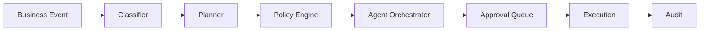

# EnterpriseOS AI

The Operating System for Autonomous Enterprises. An event-driven backend where business events are classified, planned, governed by policy, routed to replaceable agents, approved by humans, executed, monitored, and audited.



The Policy Engine is the governance boundary for budgets, approvals, compliance, escalation, and crisis activation. The COO Agent orchestrates and never executes critical actions.

## Three-command demo

```bash
uv sync
docker compose up --build
curl http://localhost:8000/health
```

OpenAPI is at `/docs`. The live graph pauses at a LangGraph approval interrupt; resume it with a human decision, then inspect the audit snapshot. Use `MemorySaver` for tests and configure Redis/PostgreSQL persistence for deployment.
