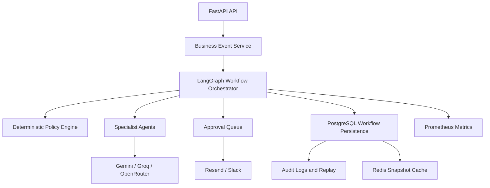

# EnterpriseOS AI

> The Operating System for Autonomous Enterprises.

EnterpriseOS AI is an event-driven enterprise operations platform that turns business signals into governed, auditable workflows. It is designed for organizations that need AI-assisted operations without surrendering control: AI recommends, policy governs, people approve, and executors perform.

[](../../actions/workflows/ci.yml)
[](https://www.python.org/)
[](https://fastapi.tiangolo.com/)
[](https://langchain-ai.github.io/langgraph/)

## Why EnterpriseOS AI

Most automation tools automate teams or departments. EnterpriseOS automates the lifecycle of a business event—whether that is a vendor bankruptcy, purchase request, equipment failure, compliance violation, or customer escalation.

Every workflow follows a consistent operating model:


This separation is deliberate:

- AI provides recommendations and structured reasoning.
- The deterministic Policy Engine decides what is permissible.
- Approval gates give humans final authority over critical actions.
- The workflow graph keeps decisions replayable and operationally observable.

## Product capabilities

| Capability | What it provides |
|---|---|
| Business Event Engine | A single intake model for operational, financial, compliance, procurement, and crisis events. |
| LangGraph Orchestration | Stateful workflows with explicit routing, conditional edges, interrupts, and resumption. |
| Human-in-the-loop | Approval requests pause workflows and resume only through an explicit decision. |
| Multi-agent operations | Planner, COO, Procurement, Vendor Intelligence, Crisis, Finance, Compliance, Operations, Audit, and Notification agents. |
| Policy governance | Deterministic budget, vendor, escalation, refund, inventory, and compliance rules. |
| Audit and replay | Persisted state snapshots and audit records for operational investigation and replay. |
| Enterprise observability | Prometheus metrics, correlation IDs, structured logging boundaries, and health endpoints. |
| Provider resilience | Structured Gemini → Groq → OpenRouter LLM fallback with timeouts and retries. |

## Demo scenarios

### Purchase request

1. A purchase event is ingested.
2. Vendor Intelligence ranks suppliers.
3. Finance validates funds and escalation thresholds.
4. Compliance checks vendor and regulatory controls.
5. COO coordinates the recommendation.
6. The workflow pauses for approval.
7. Approval resumes the graph and records the execution outcome.

### Vendor bankruptcy crisis

1. A supplier bankruptcy is classified as a crisis.
2. Crisis Agent estimates business impact, affected employees, recovery time, and alternatives.
3. Finance and Compliance validate the recovery proposal.
4. Executive approval is required before activation.
5. Notifications, workflow state, and audit evidence are retained for review.

Run both flows locally:

```bash
python scripts/demo.py
```

## Quick start

### Prerequisites

- Python 3.11+
- [uv](https://docs.astral.sh/uv/)
- Docker Desktop (recommended for PostgreSQL and Redis)

### Start the platform

```bash
cp .env.example .env
uv sync
docker compose up --build
```

Verify the service:

```bash
curl http://localhost:8000/health
```

Then open:

- API documentation: `http://localhost:8000/docs`
- OpenAPI schema: `http://localhost:8000/openapi.json`
- Prometheus metrics: `http://localhost:8000/api/v1/system/metrics/prometheus`

## Configuration

Copy `.env.example` to `.env`. Secrets are never committed.

| Variable | Purpose |
|---|---|
| `DATABASE_URL` | PostgreSQL async SQLAlchemy connection string. |
| `REDIS_URL` | Redis connection for workflow snapshot caching. |
| `JWT_SECRET_KEY` | Secret used to sign access and refresh tokens. |
| `GEMINI_API_KEY` | Primary structured-reasoning provider. |
| `GROQ_API_KEY` | Low-latency provider fallback. |
| `OPENROUTER_API_KEY` | Final LLM provider fallback. |
| `RESEND_API_KEY` | Optional approval and operational email delivery. |
| `SLACK_BOT_TOKEN` | Optional Slack notification delivery. |

Without external credentials, the platform uses deterministic repository-backed recommendations so the local demo and tests remain fully runnable.

## Architecture



The architecture follows Clean Architecture and dependency inversion. APIs coordinate application services; services depend on repository and provider interfaces; agent side effects are isolated behind injected adapters.

Read the detailed architecture in [docs/ARCHITECTURE.md](docs/ARCHITECTURE.md) and design decisions in [docs/ADRS](docs/ADRS).

## API overview

| Method | Endpoint | Description |
|---|---|---|
| `GET` | `/health` | Service liveness check. |
| `POST` | `/api/v1/auth/login` | Create JWT access and refresh tokens. |
| `POST` | `/api/v1/events` | Ingest and classify a business event. |
| `POST` | `/api/v1/events/{event_id}/orchestrate` | Run the workflow to its next interrupt or terminal state. |
| `GET` | `/api/v1/approvals` | List outstanding human approvals. |
| `POST` | `/api/v1/approvals/{approval_id}/decision` | Approve, reject, or modify a workflow decision. |
| `GET` | `/api/v1/workflows/{workflow_id}/replay` | Retrieve workflow timeline and audit evidence. |
| `GET` | `/api/v1/system/metrics/prometheus` | Export Prometheus metrics. |

Example event:

```json
{
  "event_type": "VendorBankruptcy",
  "source": "vendor-management",
  "title": "Primary supplier bankruptcy",
  "description": "Primary component supplier filed for protection.",
  "severity": "critical",
  "payload": {
    "daily_loss": 2300000,
    "employees_affected": 500,
    "recovery_budget": 100000
  }
}
```

See [docs/API_REFERENCE.md](docs/API_REFERENCE.md) for endpoint details.

## Quality and verification

```bash
ruff check app tests scripts
pytest --cov=app --cov-fail-under=85
```

The CI pipeline runs linting, tests, coverage enforcement, and a Docker build on pull requests and pushes.

## Project structure

```text
app/
  agents/          # Typed, independently testable specialist agents
  api/             # FastAPI routes and dependencies
  approvals/       # Approval lifecycle and pause/resume mechanics
  events/          # Domain event transport
  models/          # SQLAlchemy persistence models
  notifications/   # Email, Slack, and notification adapters
  repositories/    # Data-access contracts and implementations
  services/        # Policy, LLM, event, and application services
  workflows/       # LangGraph orchestration and persistence
docs/              # Architecture, ADRs, and API documentation
scripts/           # Demo and operational utilities
tests/             # Unit, integration, workflow, agent, and load tests
```

## Security and governance

- JWT authentication with role-based access controls.
- Secrets loaded from environment configuration only.
- Critical actions cannot bypass policy or approval gates.
- Approval decisions, workflow state, recommendations, and transitions are audit-ready.
- LLM providers are adapters; they never execute critical side effects.

## Contributing

1. Create a branch from `main`.
2. Keep business logic out of API routes.
3. Add or update tests for every behavioral change.
4. Run linting and coverage checks locally.
5. Open a pull request with a concise architectural rationale.

For agent-specific rules, see [AGENTS.md](AGENTS.md). For platform decisions, see [docs/ADRS](docs/ADRS).

## License

Proprietary — all rights reserved. Contact the EnterpriseOS AI team for licensing and partnership inquiries.
