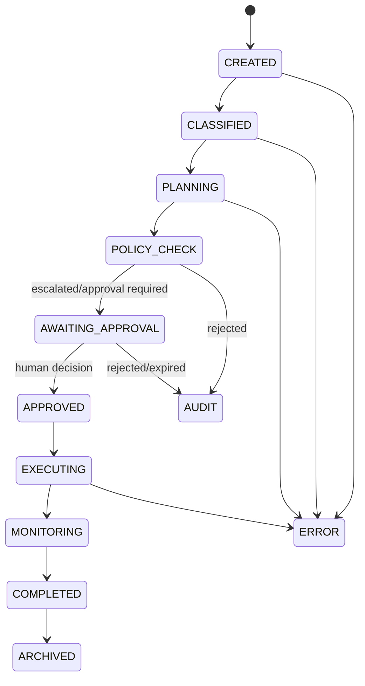

# Architecture

Clean Architecture boundaries are represented by API adapters, application services, SQLAlchemy repositories/models, provider adapters, an event bus, a configuration-driven Policy Engine, and a generic state-machine Workflow Engine. Dependency direction points inward; routes do not contain business logic.

## LangGraph flow

`WorkflowOrchestrator.build()` constructs a compiled `StateGraph` with explicit nodes and conditional edges. `interrupt()` freezes the graph at the approval node. A checkpointer such as `MemorySaver` in tests or a Redis/PostgreSQL-backed checkpointer in deployment preserves state. Resume uses `Command(resume={"decision": "approved"})` and cannot skip policy or approval.

## Data flow example

For `VendorBankruptcy`, the graph classifies the event, Planner emits continuity steps, Policy matches `CRISIS-CEO`, CrisisAgent estimates daily exposure and alternatives, Finance and Compliance validate the recommendation, COO aggregates without executing, and the graph pauses for CEO approval. Only an injected executor can perform the approved action.
